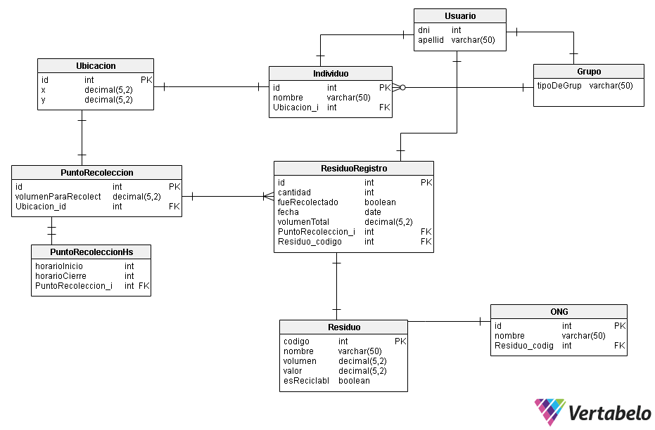

# Arquitecturas web #

### Profesores ###
* J. Andrés Díaz Pace
* Juan Manuel Rodriguez

### Indice ###

1. [Introducción](#Introduccion)
2. [Sistema](#Sistema)
3. [Modelo de datos](#Modelo-de-datos)
4. [API](#API)
    * [ONG](#ONG)
    * [Recolección](#recoleccion)
    * [Registro de residuos](#registro-de-residuos)
    * [Residuo](#residuo)
    * [Usuario](#usuario)

## Introduccion ##
 Se desea implementar un sistema de clasificación y recolección de residuos eficientes, sustentables y escalables. Un modelo para minimizar el esfuerzo en clasificación de los materiales es la separación de residuos en origen, esto es, en el domicilio.
 Específicamente, se busca implementar una aplicación Web para asistir a los vecinos de Tandil a registrar los elementos que reciclan, ofreciendo además información de interés y estadísticas personalizadas. La aplicación también será accesible por el Municipio de Tandil y le permitirá́, en principio, visualizar diversas estadísticas, proyecciones e historial de reciclaje por vecino/cuadra/barrio. 

## Sistema ##

 El sistema está comprendido por diversos package los cuales tienen cada uno distintas responsabilidades, estas son las siguientes:
Las clases base están distribuidas en los package abstracts, basura, puntos, users, organizaciones.
En el package test se realizaron todo los testeos de los package antes mencionados.
En el package API se encuentran las clases que se utilizaron para crear los endpoints de la API. Dentro del package testAPI se realizaron los testeos correspondientes. 

## Modelo de datos ##

El modelo de datos de la aplicación se encuentra de la siguiente manera:

## API ##

### ONG ###

| Endpoint  | Método | Utilidad |
|---|---|---|
|  /ONG/{id} | GET  | Obtiene un JSON con los datos de la ONG que corresponda al ID |
|  /ONG/ | POST  | Crea una nueva ONG  |
|  /ONG/{id} | DELETE  | Elimina la ONG que coincide con el parámetro especificado en la URL  |

### Recoleccion ###

| Endpoint | Método | Utilidad |
|---|---|---|
| /PuntoRecoleccion/  | GET  | Obtiene un JSON con todos los puntos de recolección disponibles |
| /PuntoRecoleccion/{id}  | GET  | Obtiene un JSON con los datos del punto de recolección |
| /PuntoRecoleccion/{id}  | PUT  | Edita el recurso que coincide con el parámetro indicado |
| /PuntoRecoleccion/{id}  | DELETE  | Elimina el recurso que coincide con el parámetro indicado |

### Registro de residuos ###

| Endpoint | Método | Utilidad |
|---|---|---|
| /Registro/{id}  | GET  | Obtiene un JSON con todos los registros de residuos disponibles que coincidan con el parámetro  |
| /Registro/  | POST   | Crea un nuevo registro de residuos |  
| /Registro/{id}  | PUT  | Edita el recurso que coincide con el parámetro indicado  |
| /Registro/{id}  | DELETE  | Elimina el recurso que coincide con el parámetro indicado  |

### Residuo ###

| Endpoint | Método | Utilidad |
|---|---|---|
| /Residuo/  | GET  |  Obtiene un JSON con todos los residuos disponibles |
| /Residuo/{id}  | GET  | Obtiene un JSON con todos los residuos disponibles que coincidan con el parámetro  |
| /Residuo/  | POST  | Crea un nuevo residuo  |
| /Residuo/  | DELETE  | Elimina el recurso que coincide con el parámetro indicado  |
|   |   |   |

### Usuario ###

| Endpoint | Método | Utilidad |
|---|---|---|
| /Users/  | GET  | Obtiene un JSON con todos los usuarios registrados en la aplicación  |
| /Users/{id}  | GET  | Obtiene un JSON con información del usuario que coincida con el parámetro especificado  |
| /Users/{id}  | PUT  | Actualiza los datos del usuario que coincida con el parámetro especificado  |
| /Users/{id}  | DELETE  | Elimina al usuario que coincida con el parámetro especificado  |
| /Users/  | POST  | Crea un nuevo usuario en la aplicación  |